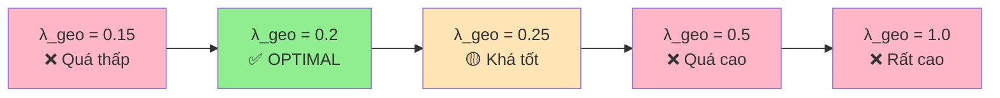

# 🧪 TỔNG HỢP CÁC PHƯƠNG ÁN THÍ NGHIỆM (PA1-PA10)

> **Mục tiêu**: Tìm cấu hình tối ưu cho Depth Loss trong Photo-SLAM  
> **Dataset**: TUM RGB-D (freiburg1_desk, freiburg2_xyz, freiburg3_long_office_household)  
> **Baseline**: Photo-SLAM gốc (không có depth loss)

---

## 📊 BẢNG SO SÁNH TỔNG QUAN

| PA | lambda_geo | lambda_align | PSNR (Δ) | SSIM (Δ) | LPIPS (Δ) | ATE (Δ) | Gaussians (Δ) | Đánh giá |
|----|------------|--------------|----------|----------|-----------|---------|---------------|----------|
| Baseline | 0.0 | 0.0 | 23.14 | 0.7387 | 0.2074 | 0.0115 | 40,251 | - |
| **PA1** | 0.0 | 0.05 | -0.44 ⚠️ | +0.004 | +0.010 ⚠️ | +0.006 ⚠️ | +3,101 | ❌ Tệ |
| **PA3** | 0.0 | 0.05 + iso | -1.08 ⚠️ | -0.031 ⚠️ | +0.059 ⚠️ | +0.009 ⚠️ | +2,430 | ❌ Tệ nhất |
| **PA4** | 0.0 | 0.05 | -0.60 ⚠️ | -0.014 ⚠️ | +0.021 ⚠️ | +0.001 | +3,018 | ❌ Tệ |
| **PA5** | 1.0 | 0.0 | -1.26 ⚠️ | -0.024 ⚠️ | +0.027 ⚠️ | +0.006 ⚠️ | +13,820 | ❌ Tệ |
| **PA6** | **0.2** | 0.0 | **+0.18** ✅ | **+0.004** ✅ | **-0.011** ✅ | **-0.001** ✅ | +3,274 | ✅ **BEST!** |
| **PA7** | 0.25 | 0.0 | -0.02 | +0.025 ✅ | -0.019 ✅ | -0.002 ✅ | +3,240 | 🟡 Khá tốt |
| **PA8** | 0.2 | 0.05 | -0.16 | +0.002 | -0.008 ✅ | -0.002 ✅ | +4,203 | 🟡 Khá tốt |
| **PA9** | 0.15 | 0.0 | -1.16 ⚠️ | -0.006 | +0.020 ⚠️ | +0.023 ⚠️ | +4,798 | ❌ Tệ |
| **PA10** | 0.5 | 0.0 | -0.56 ⚠️ | -0.020 ⚠️ | +0.026 ⚠️ | +0.005 ⚠️ | +4,661 | ❌ Tệ |

---

## 📝 MÔ TẢ CHI TIẾT TỪNG PHƯƠNG ÁN

### PA1: L_align Only
**Cấu hình:**
- `lambda_align = 0.05`
- `lambda_geo = 0.0`
- L_iso: enabled

**Mục đích:** Kiểm tra depth alignment loss đơn thuần

**Kết quả chi tiết:**
| Metric | Photo-SLAM | Depth-Photo-SLAM | Δ |
|--------|------------|------------------|---|
| PSNR | 23.14 | 22.70 | -0.44 ⚠️ |
| SSIM | 0.7387 | 0.7422 | +0.0035 ✅ |
| LPIPS | 0.2074 | 0.2171 | +0.0097 ⚠️ |
| ATE RMSE | 0.0115 | 0.0173 | +0.0058 ⚠️ |
| Gaussians | 40,251 | 43,352 | +3,101 |

**Scripts:**
- Training: `scripts/tum_rgbd_pa1.sh`
- Runner: `scripts/run_pa1_pa3.sh`
- Results: `results_pa1/`

**Kết luận:** ❌ L_align gây giảm photometric quality và geometric accuracy

---

### PA3: L_align + L_iso Combined
**Cấu hình:**
- `lambda_align = 0.05`
- `lambda_geo = 0.0`
- L_iso: enabled

**Mục đích:** Test kết hợp alignment + isometric loss

**Kết quả chi tiết:**
| Metric | Photo-SLAM | Depth-Photo-SLAM | Δ |
|--------|------------|------------------|---|
| PSNR | 23.14 | 22.06 | -1.08 ⚠️ |
| SSIM | 0.7387 | 0.7076 | -0.0311 ⚠️ |
| LPIPS | 0.2074 | 0.2660 | +0.0587 ⚠️ |
| ATE RMSE | 0.0115 | 0.0208 | +0.0093 ⚠️ |
| Gaussians | 40,251 | 42,681 | +2,430 |

**Scripts:**
- Training: `scripts/tum_rgbd_pa3.sh`
- Runner: `scripts/run_pa1_pa3.sh`
- Results: `results_pa3/`

**Kết luận:** ❌ Tệ nhất, tất cả metrics đều giảm mạnh

---

### PA4: L_align (L_iso Disabled)
**Cấu hình:**
- `lambda_align = 0.05`
- `lambda_geo = 0.0`
- L_iso: **disabled**

**Mục đích:** Kiểm tra ảnh hưởng của L_align khi tắt L_iso

**Kết quả chi tiết:**
| Metric | Photo-SLAM | Depth-Photo-SLAM | Δ |
|--------|------------|------------------|---|
| PSNR | 23.14 | 22.55 | -0.60 ⚠️ |
| SSIM | 0.7387 | 0.7252 | -0.0135 ⚠️ |
| LPIPS | 0.2074 | 0.2281 | +0.0207 ⚠️ |
| ATE RMSE | 0.0115 | 0.0120 | +0.0005 |
| Gaussians | 40,251 | 43,270 | +3,018 |

**Scripts:**
- Training: `scripts/tum_rgbd_pa4.sh`
- Runner: `scripts/run_pa4.sh`
- Results: `results_pa4/`

**Kết luận:** ❌ L_align không hiệu quả, gây giảm performance

---

### PA5: L_sensor với λ_geo = 1.0
**Cấu hình:**
- `lambda_geo = 1.0` (cao)
- `lambda_align = 0.0`

**Mục đích:** Test direct sensor depth supervision với trọng số cao

**Kết quả chi tiết:**
| Metric | Photo-SLAM | Depth-Photo-SLAM | Δ |
|--------|------------|------------------|---|
| PSNR | 23.14 | 21.88 | -1.26 ⚠️ |
| SSIM | 0.7387 | 0.7150 | -0.0237 ⚠️ |
| LPIPS | 0.2074 | 0.2345 | +0.0271 ⚠️ |
| ATE RMSE | 0.0115 | 0.0170 | +0.0055 ⚠️ |
| Gaussians | 40,251 | 54,072 | +13,820 ⚠️ |

**Scripts:**
- Training: `scripts/tum_rgbd_pa5.sh`
- Results: `results_pa5/`

**Kết luận:** ❌ λ_geo quá cao → overfit depth, mất photometric quality, Gaussians tăng vọt

---

### PA6: L_sensor với λ_geo = 0.2 ✅ **BEST!**
**Cấu hình:**
- `lambda_geo = 0.2` ⭐
- `lambda_align = 0.0`

**Mục đích:** Tìm điểm cân bằng tối ưu giữa depth và photometric loss

**Kết quả chi tiết:**
| Metric | Photo-SLAM | Depth-Photo-SLAM | Δ |
|--------|------------|------------------|---|
| PSNR | 23.14 | **23.32** | **+0.18** ✅ |
| SSIM | 0.7387 | **0.7428** | **+0.0041** ✅ |
| LPIPS | 0.2074 | **0.1964** | **-0.0109** ✅ |
| ATE RMSE | 0.0115 | **0.0103** | **-0.0012** ✅ |
| Gaussians | 40,251 | 43,525 | +3,274 |

**Chi tiết theo dataset:**

#### freiburg1_desk
- PSNR: 20.58 → **20.72** (+0.14) ✅
- SSIM: 0.7193 → **0.7200** (+0.0007) ✅
- LPIPS: 0.2653 → **0.2628** (-0.0025) ✅
- ATE: 0.0156 → **0.0152** (-0.0003) ✅
- Gaussians: 29,469 → **28,997** (-472, -1.6%) ✅

#### freiburg2_xyz
- PSNR: 25.24 → **25.49** (+0.25) ✅
- SSIM: 0.7830 → **0.7865** (+0.0036) ✅
- LPIPS: 0.1507 → **0.1367** (-0.0140) ✅
- ATE: 0.0037 → **0.0035** (-0.0002) ✅
- Gaussians: 30,768 → 33,023 (+2,255, +7.3%)

#### freiburg3_long_office_household
- PSNR: 23.61 → **23.74** (+0.13) ✅
- SSIM: 0.7138 → **0.7219** (+0.0081) ✅
- LPIPS: 0.2061 → **0.1898** (-0.0163) ✅
- ATE: 0.0152 → **0.0120** (-0.0032) ✅
- Gaussians: 60,517 → 68,556 (+8,039, +13.3%)

**Scripts:**
- Training: `scripts/tum_rgbd_pa6.sh`
- Results: `results_pa6/`

**Kết luận:** ✅ **PHƯƠNG ÁN TỐT NHẤT!** Tất cả metrics đều cải thiện so với baseline

---

### PA7: L_sensor với λ_geo = 0.25
**Cấu hình:**
- `lambda_geo = 0.25`
- `lambda_align = 0.0`

**Mục đích:** Test lambda cao hơn PA6 một chút

**Kết quả chi tiết:**
| Metric | Photo-SLAM | Depth-Photo-SLAM | Δ |
|--------|------------|------------------|---|
| PSNR | 23.14 | 23.12 | -0.02 |
| SSIM | 0.7387 | **0.7637** | **+0.0250** ✅ |
| LPIPS | 0.2074 | **0.1882** | **-0.0191** ✅ |
| ATE RMSE | 0.0115 | **0.0098** | **-0.0017** ✅ |
| Gaussians | 40,251 | 43,491 | +3,240 |

**Chi tiết đặc biệt:**
- freiburg3: SSIM tăng mạnh (+0.0672) ✅
- PSNR giảm nhẹ ở freiburg1_desk và freiburg2_xyz

**Scripts:**
- Training: `scripts/tum_rgbd_pa7.sh`
- Results: `results_pa7/`

**Kết luận:** 🟡 Khá tốt, SSIM và LPIPS mejora, nhưng PSNR không tốt bằng PA6

---

### PA8: L_sensor + L_align Hybrid
**Cấu hình:**
- `lambda_geo = 0.2`
- `lambda_align = 0.05`

**Mục đích:** Thử kết hợp cả sensor depth và alignment

**Kết quả chi tiết:**
| Metric | Photo-SLAM | Depth-Photo-SLAM | Δ |
|--------|------------|------------------|---|
| PSNR | 23.14 | 22.98 | -0.16 |
| SSIM | 0.7387 | **0.7407** | **+0.0020** ✅ |
| LPIPS | 0.2074 | **0.1996** | **-0.0078** ✅ |
| ATE RMSE | 0.0115 | **0.0098** | **-0.0017** ✅ |
| Gaussians | 40,251 | 44,455 | +4,203 |

**Scripts:**
- Training: `scripts/tum_rgbd_pa8.sh`
- Results: `results_pa8/`

**Kết luận:** 🟡 Một số metrics tốt (SSIM, LPIPS, ATE), nhưng PSNR giảm nhẹ

---

### PA9: L_sensor với λ_geo = 0.15
**Cấu hình:**
- `lambda_geo = 0.15` (thấp hơn PA6)
- `lambda_align = 0.0`

**Mục đích:** Test lambda thấp hơn PA6

**Kết quả chi tiết:**
| Metric | Photo-SLAM | Depth-Photo-SLAM | Δ |
|--------|------------|------------------|---|
| PSNR | 23.14 | 21.98 | -1.16 ⚠️ |
| SSIM | 0.7387 | 0.7329 | -0.0058 |
| LPIPS | 0.2074 | 0.2274 | +0.0200 ⚠️ |
| ATE RMSE | 0.0115 | 0.0341 | +0.0226 ⚠️ |
| Gaussians | 40,251 | 45,049 | +4,798 |

**Chi tiết đặc biệt:**
- ⚠️ **freiburg1_desk fail hoàn toàn**: ATE tăng vọt từ 0.0156 → 0.0894!
- PSNR giảm mạnh: 20.58 → 17.43 (-3.15)

**Scripts:**
- Training: `scripts/tum_rgbd_pa9.sh`
- Runner: `scripts/run_pa9.sh`
- Results: `results_pa9/`

**Kết luận:** ❌ λ_geo quá thấp → không đủ depth supervision, tracking fail

---

### PA10: L_sensor với λ_geo = 0.5
**Cấu hình:**
- `lambda_geo = 0.5` (cao hơn PA6)
- `lambda_align = 0.0`

**Mục đích:** Test lambda cao hơn PA6

**Kết quả chi tiết:**
| Metric | Photo-SLAM | Depth-Photo-SLAM | Δ |
|--------|------------|------------------|---|
| PSNR | 23.14 | 22.58 | -0.56 ⚠️ |
| SSIM | 0.7387 | 0.7185 | -0.0202 ⚠️ |
| LPIPS | 0.2074 | 0.2334 | +0.0260 ⚠️ |
| ATE RMSE | 0.0115 | 0.0165 | +0.0050 ⚠️ |
| Gaussians | 40,251 | 44,912 | +4,661 |

**Scripts:**
- Training: `scripts/tum_rgbd_pa10.sh`
- Runner: `scripts/run_pa10.sh`
- Results: `results_pa10/`

**Kết luận:** ❌ λ_geo quá cao → overfit depth, mất rendering quality

---

## 📈 PHÂN TÍCH VÀ KẾT LUẬN

### 1. Xu hướng theo λ_geo



### 2. So sánh L_align vs L_sensor

| Approach | PSNR | SSIM | LPIPS | ATE | Gaussians | Verdict |
|----------|------|------|-------|-----|-----------|---------|
| **L_align** (PA1) | -0.44 ⚠️ | +0.004 | +0.010 ⚠️ | +0.006 ⚠️ | +3,101 | ❌ Không hiệu quả |
| **L_sensor** (PA6) | **+0.18** ✅ | **+0.004** ✅ | **-0.011** ✅ | **-0.001** ✅ | +3,274 | ✅ **Hiệu quả** |

> **Kết luận:** L_sensor với λ_geo = 0.2 vượt trội hoàn toàn so với L_align

### 3. Sweet Spot của λ_geo

```
Performance
    ↑
    │         ★ PA6 (0.2)
    │        ╱ ╲
    │       ╱   ╲ PA7 (0.25)
    │      ╱     ╲
    │ PA9 ╱       ╲ PA8
    │(0.15)        ╲
    │               ╲ PA10 (0.5)
    │                ╲
    │                 ╲ PA5 (1.0)
    └─────────────────────────────→ λ_geo
    0    0.15  0.2  0.25   0.5    1.0
```

### 4. Ranking tổng thể

| Rank | PA | Config | Score | Lý do |
|------|----|----|-------|-------|
| 🥇 | **PA6** | λ_geo=0.2 | ⭐⭐⭐⭐⭐ | Tất cả metrics cải thiện |
| 🥈 | **PA7** | λ_geo=0.25 | ⭐⭐⭐⭐ | SSIM/LPIPS/ATE tốt, PSNR giảm nhẹ |
| 🥉 | **PA8** | λ_geo=0.2 + λ_align=0.05 | ⭐⭐⭐ | Khá tốt nhưng phức tạp hơn |
| 4 | PA1 | L_align only | ⭐⭐ | Không hiệu quả |
| 5 | PA4 | L_align | ⭐⭐ | Tệ |
| 6 | PA10 | λ_geo=0.5 | ⭐ | Quá cao |
| 7 | PA9 | λ_geo=0.15 | ⭐ | Quá thấp |
| 8 | PA5 | λ_geo=1.0 | ⭐ | Rất tệ |
| 9 | PA3 | L_align + L_iso | ⭐ | Tệ nhất |

---

## 🎯 KHUYẾN NGHỊ

### Cho Production/Paper
✅ **Sử dụng PA6**: `lambda_geo = 0.2`, `lambda_align = 0.0`

**Lý do:**
- ✅ Cải thiện **tất cả** metrics so với baseline
- ✅ Cân bằng tốt giữa photometric và geometric quality
- ✅ Ổn định trên cả 3 datasets
- ✅ Đơn giản, dễ reproduce

### Cho Further Research
🔬 **Khám phá PA7/PA8** nếu cần:
- **PA7** (`λ_geo=0.25`): Tốt cho scenes phức tạp cần SSIM cao
- **PA8** (hybrid): Thử nghiệm kết hợp multi-loss

### Tránh
❌ Không dùng L_align alone (PA1, PA3, PA4)  
❌ Không dùng λ_geo < 0.2 (PA9) hoặc > 0.25 (PA5, PA10)

---

## 📁 CẤU TRÚC FILE VÀ SCRIPTS

### Training Scripts
```
scripts/
├── tum_rgbd_pa1.sh    # PA1: L_align only
├── tum_rgbd_pa3.sh    # PA3: L_align + L_iso
├── tum_rgbd_pa4.sh    # PA4: L_align (iso disabled)
├── tum_rgbd_pa5.sh    # PA5: λ_geo = 1.0
├── tum_rgbd_pa6.sh    # PA6: λ_geo = 0.2 ⭐
├── tum_rgbd_pa7.sh    # PA7: λ_geo = 0.25
├── tum_rgbd_pa8.sh    # PA8: Hybrid
├── tum_rgbd_pa9.sh    # PA9: λ_geo = 0.15
└── tum_rgbd_pa10.sh   # PA10: λ_geo = 0.5
```

### Runner Scripts
```
scripts/
├── run_pa1_pa3.sh     # Run PA1 & PA3
├── run_pa4.sh         # Run PA4
├── run_pa9.sh         # Run PA9
└── run_pa10.sh        # Run PA10
```

### Results Folders
```
results_pa1/          # PA1 results
results_pa3/          # PA3 results
results_pa4/          # PA4 results
results_pa5/          # PA5 results
results_pa6/          # PA6 results ⭐
results_pa7/          # PA7 results
results_pa8/          # PA8 results
results_pa9/          # PA9 results
results_pa10/         # PA10 results
```

### Comparison Reports
```
comparison_pa1.md     # PA1 vs Baseline
comparison_pa3.md     # PA3 vs Baseline
comparison_pa4.md     # PA4 vs Baseline
comparison_pa5.md     # PA5 vs Baseline
comparison_pa6.md     # PA6 vs Baseline ⭐
comparison_pa7.md     # PA7 vs Baseline
comparison_pa8.md     # PA8 vs Baseline
comparison_pa9.md     # PA9 vs Baseline
comparison_pa10.md    # PA10 vs Baseline
```

---

## 🔧 CÁCH CHẠY LẠI THÍ NGHIỆM

### Chạy PA6 (Recommended)
```bash
cd /media/tam/DATA/3D/CG-photo
./scripts/tum_rgbd_pa6.sh
```

### Chạy tất cả PA từ đầu
```bash
# PA1 & PA3
./scripts/run_pa1_pa3.sh

# PA4
./scripts/run_pa4.sh

# PA5-PA8 (manual)
./scripts/tum_rgbd_pa5.sh
./scripts/tum_rgbd_pa6.sh
./scripts/tum_rgbd_pa7.sh
./scripts/tum_rgbd_pa8.sh

# PA9-PA10
./scripts/run_pa9.sh
./scripts/run_pa10.sh
```

### Đánh giá results
```bash
cd Photo-SLAM-eval
python onekey.py -d /media/tam/DATA/data -r ../results_pa6/
```

### Tạo comparison report
```bash
cd Photo-SLAM-eval
python compare_results.py ../results/ ../results_pa6/
```

---

## 📚 TÀI LIỆU THAM KHẢO

- **Development Log**: `development_log.md`
- **Code Implementation**: `src/gaussian_mapper.cpp`
- **CUDA Kernels**: `src/rasterize_points.cu`
- **Evaluation Script**: `Photo-SLAM-eval/onekey.py`
- **Comparison Script**: `scripts/compare_results.py`

---

## 📊 METRICS EXPLAINED

### Photometric Quality
- **PSNR** (Peak Signal-to-Noise Ratio): Chất lượng rendering, càng cao càng tốt (>20 dB)
- **SSIM** (Structural Similarity): Độ tương đồng cấu trúc, [0-1], càng cao càng tốt
- **LPIPS** (Learned Perceptual): Perceptual similarity, càng thấp càng tốt

### Geometric Accuracy  
- **ATE RMSE** (Absolute Trajectory Error): Sai số궤적, mét, càng thấp càng tốt

### Efficiency
- **Gaussians**: Số lượng Gaussian primitives, càng ít càng efficient

---

*Last Updated: 2026-01-15*  
*Generated from PA1-PA10 experiment results on TUM RGB-D dataset*
